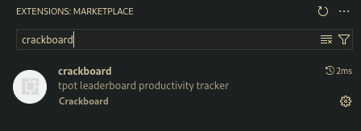
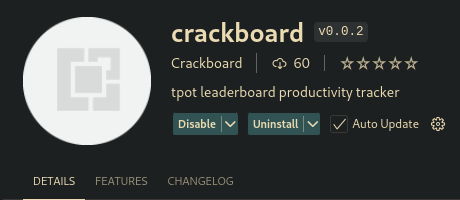
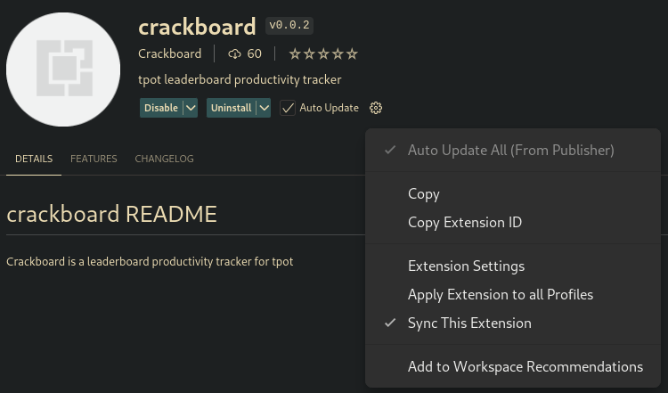
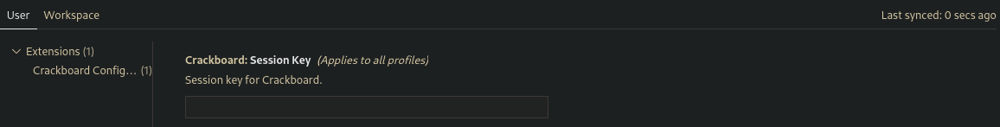

# crackboard README
# **Crackboard**

**Crackboard** is a leaderboard productivity tracker designed for **TPot** users.

## Visual Studio Code Extension

Crackboard is also available as an extension for **Visual Studio Code**.

### Installation Instructions:

1. Open **Visual Studio Code**.
2. Navigate to the Extensions tab (or press `Ctrl + Shift + X`).
3. In the search bar, type **Crackboard**.
4. Install the extension from the search results.

Install the extension as shown below:

## Setting Up Session Key for VS Code

1. Go to the **Crackboard** extension tab.
2. Click on the extension settings.

3. Paste your session key copied from <strong>[crackboard](https://crackboard.dev/)</strong>.

   
    
   

4. This session key tracks your typing activity in real-time and updates your progress on the website.
