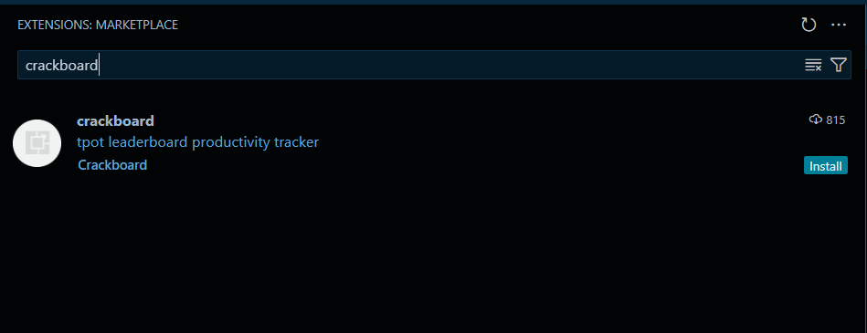

# Crackboard VS Code Extension

Crackboard is a productivity tracker designed for [TPot](https://tpot.io/) users, providing a leaderboard to monitor coding activity. This Visual Studio Code (VS Code) extension integrates seamlessly with Crackboard, allowing real-time tracking of your coding sessions.

## Features

- **Real-time Activity Tracking**: Monitor your coding activity directly within VS Code.
- **Leaderboard Integration**: Automatically update your progress on the Crackboard leaderboard.
- **Language Detection**: Track the programming languages you use and the time spent on each.

## Installation

To install the Crackboard extension in VS Code:

1. **Open VS Code**.
2. **Navigate to the Extensions View**:
   - Click on the square icon in the sidebar.
   - Or press `Ctrl + Shift + X`.
3. **Search for "Crackboard"**:
   - Type `Crackboard` in the search bar.
     
4. **Install the Extension**:
   - Click on the "Install" button next to the Crackboard extension.
     

Alternatively, you can install the extension directly from the [Visual Studio Marketplace](https://marketplace.visualstudio.com/items?itemName=crackboard.crackboard).

## Setup

After installation, set up your session key to enable tracking:

1. **Obtain Your Session Key**:

   - Visit [Crackboard](https://crackboard.dev/) and log in.
     
   - Copy your unique session key from your profile.
     

2. **Configure the Extension**:
   - In VS Code, press `Ctrl + Shift + P` to open the Command Palette.
   - Type `Crackboard: Set Session Key` and select it.
   - Paste your session key when prompted.
     
     This configuration allows the extension to track your coding activity and update your progress on Crackboard.

## Usage

With the session key configured, the extension will automatically:

- **Track Coding Activity**: Monitor the time you spend coding in different languages.
- **Update Leaderboard**: Send your activity data to Crackboard to update your standings.

To view your progress and compare with others, visit the [Crackboard Leaderboard](https://crackboard.dev/).

## Contributing

We welcome contributions to enhance the Crackboard VS Code Extension. To contribute:

1. **Fork the Repository**:
   - Click on the "Fork" button at the top of the [repository page](https://github.com/crackboard-dev/crackboard-vsc).
2. **Clone Your Fork**:
   - Run `git clone https://github.com/your-username/crackboard-vsc.git`.
3. **Create a New Branch**:
   - Run `git checkout -b feature/your-feature-name`.
4. **Make Your Changes**:
   - Implement your feature or fix.
5. **Commit and Push**:
   - Run `git commit -m "Description of your changes"`.
   - Run `git push origin feature/your-feature-name`.
6. **Submit a Pull Request**:
   - Go to your forked repository on GitHub.
   - Click on "Compare & pull request".
   - Provide a clear description of your changes and submit.

For detailed guidelines, refer to the [CONTRIBUTING.md](https://github.com/crackboard-dev/crackboard-vsc/blob/main/CONTRIBUTING.md) file.

## Support

For support or inquiries:

- **GitHub Issues**: Submit an issue on the [Issues Page](https://github.com/crackboard-dev/crackboard-vsc/issues).
